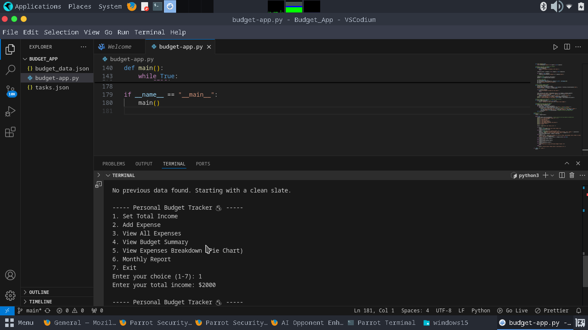
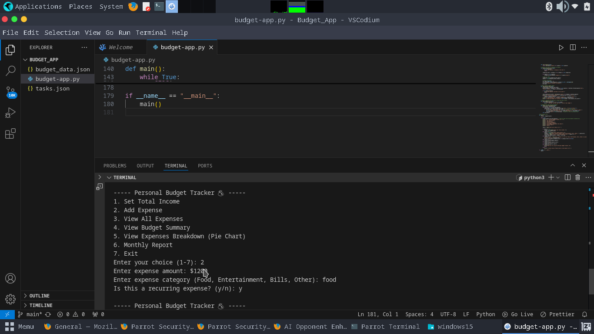
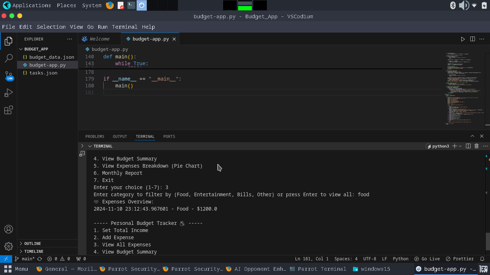

# Personal Budget Tracker 💰

Welcome to the *Personal Budget Tracker* app! This simple Python program helps you track your income, expenses, and calculate your remaining budget. You can add data visualization with pie charts, track monthly expenses, and more! 🚀

## Features ✨

- *Track Income & Expenses 💸*: Record your income and expenses by category (e.g., Food, Entertainment, Bills).
- *Remaining Budget Calculation 🧮*: Automatically calculates how much money you have left after expenses.
- *Expense Breakdown 📊*: Visualize your spending with pie charts showing the distribution of expenses by category.
- *Transaction History 🔄*: Keep track of all your transactions.
- *Monthly Report 🗓️*: View a monthly summary of your expenses.
- *Data Persistence 💾*: Save your data to a file (budget_data.json) to persist between sessions.
- *Category-based Expense Filter 📂*: Filter expenses by category (e.g., Food, Bills).
- *Budget Alerts ⚠️*: Receive a warning when your expenses reach or exceed 80% of your income.
- *Recurring Expenses 🔄*: Automatically track recurring expenses, such as subscriptions.

---

## Getting Started 🚀

### Prerequisites ⚙️

Before you start, ensure you have *Python* and *matplotlib* installed on your system.

1. *Install Python*: Ensure Python 3 is installed by running the following command in your terminal:
    bash
    python3 --version
    
   If not installed, install Python 3 using:
    bash
    sudo apt install python3
    

2. *Install Dependencies*: The project uses matplotlib for pie chart visualization. Install it by running:
    bash
    pip3 install matplotlib
    

---

## How to Run the Project ⚡

1. *Clone the Repository* 🍴:
    To clone the repository to your local machine, run the following command:
    bash
    git clone https://github.com/your-username/your-repository.git
    cd your-repository
    

2. *Run the Python Script* 🎯:
    In your terminal, run the script using:
    bash
    python3 budget_tracker.py
    

3. *Interact with the Program* 📝:
    Once the program starts, you'll be presented with options to set your income, add expenses, view the budget summary, and more. Follow the on-screen prompts and make your selections.

---

## Available Options 🧩

### 1. Set Total Income 💵
Enter your total income for the month. This will be used to calculate your remaining budget after expenses.

### 2. Add Expense 💸
Add your expenses by entering the amount and selecting a category (e.g., Food, Entertainment, Bills).

### 3. View All Expenses 🧐
View all recorded expenses along with the category and date.

### 4. View Budget Summary 💰
Get a summary of your total income, total expenses, and remaining budget.

### 5. View Expenses Breakdown (Pie Chart) 📊
Visualize your spending across different categories in a pie chart.

### 6. Monthly Report 📅
View a monthly report showing all your expenses and the remaining budget for the month.

### 7. Exit 🚪
Exit the application. Your data will be saved automatically.

---

## Additional Features 🎉

- *Category-based Expense Filter 📂*: You can filter your expenses by category (e.g., Food, Entertainment).
    - Example: View only "Food" expenses for the month.
  
- *Budget Alerts ⚠️*: Receive an alert when your total expenses reach 80% or more of your income.
    - Example: If your income is $3000 and you spend $2400, you'll get a warning!

- *Recurring Expenses 🔄*: Set recurring expenses (e.g., monthly subscriptions). The system will automatically add them after 30 days.
    - Example: You have a subscription for $10 that recurs every month; the system will add this automatically on the next cycle.

---

## Data Persistence 💾

The program stores your data in a *JSON file* (budget_data.json). This ensures that your data is saved between sessions.

- You can check or modify the saved file manually.
- The data includes income, expenses, transactions, and recurring expenses.

---

## Screenshots 📸

Here are some screenshots of how the app works:

1. *Set Income*: Add your monthly income.
   
](#)

2. *Add Expense*: Record your expenses.
   
](#)

3. *View Budget Summary*: View how much you have left.
   
](#)

4. *View Expenses Breakdown (Pie Chart)*: Visualize your spending.
   
](#)

---

## Contributing 🛠️

We welcome contributions to improve this project! If you have any suggestions or want to add new features, follow these steps:

1. *Fork the Repository* 🍴
2. *Create Your Feature Branch*:
    bash
    git checkout -b feature/YourFeature
    
3. *Commit Your Changes*:
    bash
    git commit -m 'Add a new feature'
    
4. *Push to the Branch*:
    bash
    git push origin feature/YourFeature
    
5. *Open a Pull Request* 📬

---

## License 📝

This project is licensed under the MIT License. See the [LICENSE](LICENSE) file for details.

---

## Acknowledgements 🙌

- Special thanks to the contributors who made this project better! 🎉
- Inspired by various budgeting tools and apps. 📱

---

## Final Notes 📝

Thank you for using the *Personal Budget Tracker*! 💸 Your feedback is always appreciated. Happy budgeting! 😊

---

